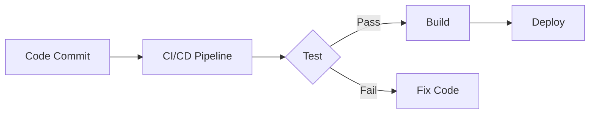
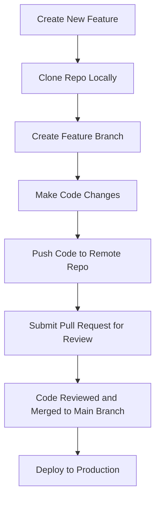
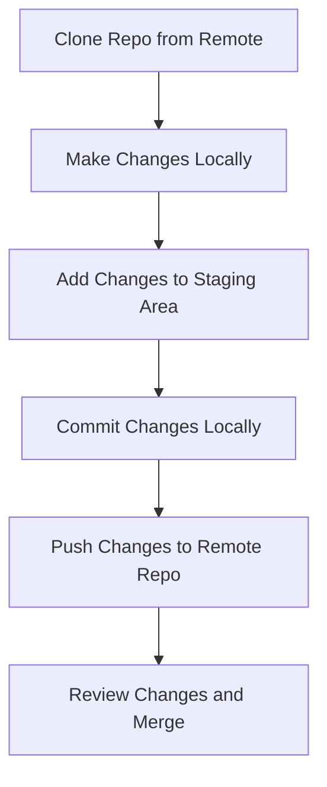
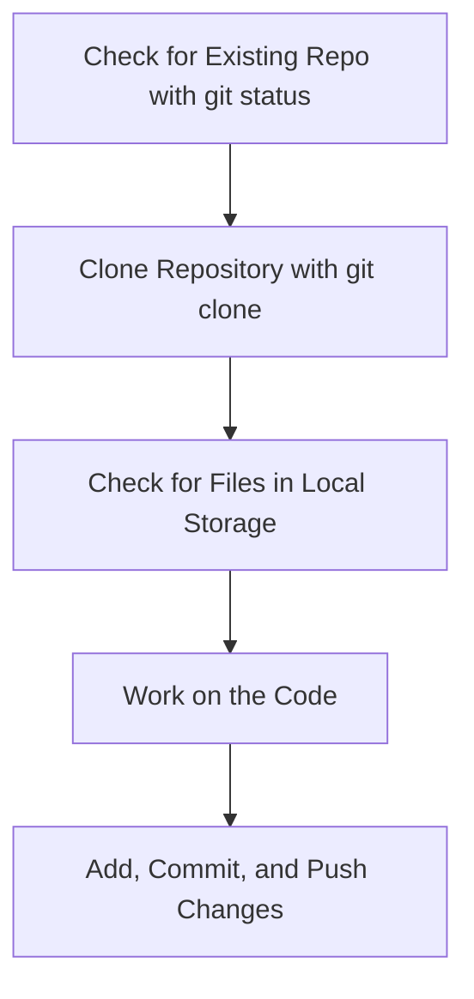

# Version Control, CI/CD, Repositories, and Setup Guide

## 1. **Version Control**

Version control is a system that records changes to a file or set of files over time so that you can recall specific versions later.

### **S3 Versioning**

- **Definition**: S3 versioning allows you to keep multiple versions of an object (file) in an Amazon S3 bucket. This helps in protecting data from accidental deletion or overwriting.
- **Use Case**: In case of accidental deletions, you can retrieve the latest or previous versions of objects.

### **Normal Version Control (Git)**

- **Definition**: Version control, specifically with Git, allows developers to track and manage changes in the source code over time. It provides a history of project development, which can be useful in case of errors, collaboration, or rollbacks.

### **Example**:

- Suppose you are working on a website. Each time you make a change to a file, Git tracks that change and stores a version. If the new code causes an error, you can revert to an earlier version using Git.

## 2. **Version Control Platforms: GitHub vs. GitLab**

| Feature            | GitHub                                                       | GitLab                                       |
| ------------------ | ------------------------------------------------------------ | -------------------------------------------- |
| **Purpose**        | Version control and collaboration platform                   | Version control with built-in CI/CD features |
| **CI/CD**          | Requires integration with GitHub Actions or third-party tools like Jenkins | Built-in CI/CD pipelines                     |
| **Authentication** | Uses OAuth, SSH keys                                         | Uses OAuth, SSH keys                         |
| **Popularity**     | Highly popular with open-source projects                     | More common in private enterprise use        |
| **Code Review**    | Extensive pull request (PR) functionality                    | Offers merge requests with more control      |

- Both **GitHub** and **GitLab** are remote version control platforms, commonly used by developers for collaboration.
- **Local platforms**: Examples include Bitbucket and SVN, which developers often use for their local repositories.

---

## 3. **CI/CD (Continuous Integration/Continuous Deployment)**

### **Definition**:

CI/CD stands for **Continuous Integration** and **Continuous Deployment**:

- **Continuous Integration (CI)**: Automatically test and integrate new code changes into the existing codebase, reducing integration issues.
- **Continuous Deployment (CD)**: Automatically deploys integrated code to production after passing all tests.

### **Using CI/CD in GitHub or GitLab**

- **GitHub**: CI/CD can be implemented using GitHub Actions.
- **GitLab**: CI/CD pipelines are built-in and offer extensive configuration via `.gitlab-ci.yml`.

#### **Steps for CI/CD Pipeline Setup**:

1. **Create Repository**: Set up your project on GitHub or GitLab.
2. **Configure a CI/CD file**:
   - **GitHub Actions**: Create a `.github/workflows/main.yml` file and define steps for testing and deployment.
   - **GitLab CI**: Add a `.gitlab-ci.yml` file with jobs for testing, building, and deployment.
3. **Run Jobs Automatically**: CI/CD automatically tests, builds, and deploys code after every push to the repository.



---

## 4. **Repository (Repo)**

### **Definition**:

A **repository** is a directory or folder where project files are stored. It contains all the files and folders of the project and a history of changes made to the code.

- Example: In Amazon, the **cart module** is managed by a specific team, while another team manages the **checkout module**. These teams collaborate by merging all modules into one main repository to launch the complete Amazon website.

### **Senior Developer Role**:

- A senior developer typically sets up the repository, gives instructions on what code needs to be written, and grants access to junior developers.

### **Junior Developer Role**:

- Junior developers clone the repository to their local machines, make changes, and push the changes back to their local repository.
- They typically don’t have write access to the central repository.

---

## 5. **Git Client: Git Bash**

- **Git Bash** is a command-line interface (CLI) that mimics Linux-like commands on Windows. It’s commonly used to interact with Git repositories using commands like `git clone`, `git pull`, and `git push`.

---

## 6. **Setting Up a Local Repository**

### **Steps to Work in a Repo**:

1. **Authentication**:
   - Set up authentication with GitHub or GitLab, so you don’t need to enter your username and password every time.

2. **SSH Authentication**:
   - For added security and convenience, set up **SSH authentication**. This ensures that your repository can be securely accessed without requiring credentials for every interaction.

### **Authentication Setup**:

1. Go to Google and search for "create SSH key for GitHub".
2. Follow the steps to generate an SSH key.
3. Add the generated SSH key to your GitHub account using the following email:
   - `midwayviber9@gmail.com`

---

## **Git Workflow**



---

## Additional Notes:

- **Authentication**: Ensure SSH authentication is set up for seamless access to your remote repositories.
- **Different Modules**: In large projects, different teams handle various modules, such as the **payment gateway** or **user management**. All these modules are integrated before the final product launch.

# Cloning a Git Repository to Your Computer

### **Step 1: Check the Current Directory for Git Versioning**

1. Open **Git Bash** or a terminal.

2. Navigate to the folder where you want to clone the repository.

3. Type the command:

   ```bash
   git status
   ```

4. If it says `fatal: not a git repository (or any of the parent directories)`, this means that the current directory is not under version control yet.

---

### **Step 2: Clone the Repository**

To get a copy of the repository onto your local machine, you'll need to use the `git clone` command.

1. In **Git Bash**, type the following command to clone a repository using SSH:

   ```bash
   git clone git@github.com:midwayviber/new.git
   ```

   - **Explanation**: The `git clone` command creates a copy of the remote repository (located on GitHub, GitLab, etc.) into your local computer.
   - The link `git@github.com:midwayviber/new.git` is the SSH URL of the repository you want to clone.

   

---

### **Step 3: Check the Cloned Repository on Your Local Computer**

- After cloning, the repository is copied into your local machine.

- Navigate to **C:/Users/your_user/** or wherever you ran the `git clone` command.

- You should find a new folder with the same name as the repository you cloned, containing all the project files.

  

---

### **Step 4: Basic Git Commands After Cloning**

1. **Check the Repository Status**:

   - After cloning, move into the cloned repository folder by typing:

     ```bash
     cd new
     ```

   - Now, check the status of your cloned repository:

     ```bash
     git status
     ```

   - If everything is correct, it should say `On branch main` or `On branch master`.

2. **Update the Repository**:

   - If the repository is updated by other developers, you can pull the latest changes using:

     ```bash
     git pull
     ```

3. **Adding Changes**:

   - After making changes to the repository, you can add those changes to the staging area:

     ```bash
     git add .
     ```

4. **Committing Changes**:

   - To commit the changes with a message:

     ```bash
     git commit -m "Your commit message"
     ```

5. **Pushing Changes to the Remote Repository**:

   - Once changes are committed, you can push them to the remote repository using:

     ```bash
     git push origin main
     ```

---

## **Git Workflow**

Here’s a simplified Git workflow to visualize the steps you take when working with a repository:



---

### **Definitions**:

1. **Repository (Repo)**: A project folder that stores code and history of changes.
2. **SSH**: Secure Shell, a protocol used to securely access remote systems. It allows secure authentication and communication with GitHub, GitLab, etc.
3. **Clone**: A command that creates a local copy of a remote repository on your computer.
4. **Git Status**: A command used to check the current state of the working directory and the staging area.

---

### **Additional Tips**:

- **Always use SSH** for cloning repositories if you have set up SSH authentication. It’s more secure and does not require entering your credentials every time.

- **Before making changes**, always pull the latest version of the repository to ensure you’re working with the most up-to-date code.

---

## **Final Notes on Git Commands**:

- **Git Clone**: To copy a remote repository to your local machine.
- **Git Status**: To check the current status of the repository.
- **Git Add**: To add modified files to the staging area.
- **Git Commit**: To commit changes locally with a message.
- **Git Push**: To push committed changes to the remote repository.

---

### **Flowchart of Cloning a Git Repository**



---

By following these steps, you can successfully clone and work on a Git repository locally.
