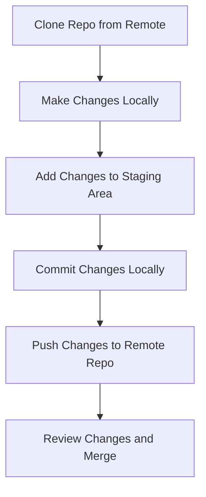
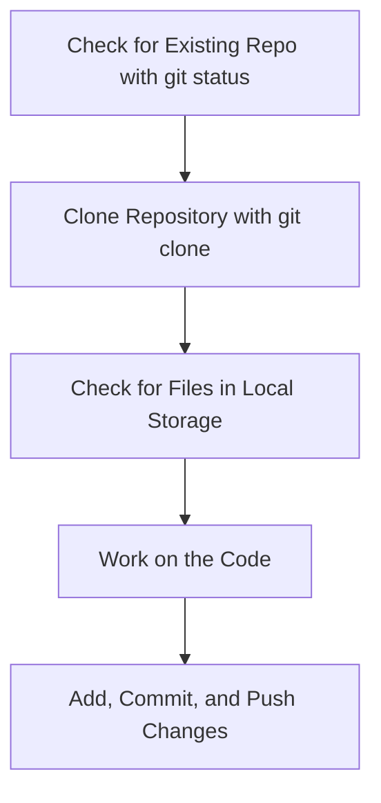

# Cloning a Git Repository to Your Computer

### **Step 1: Check the Current Directory for Git Versioning**

1. Open **Git Bash** or a terminal.

2. Navigate to the folder where you want to clone the repository.

3. Type the command:

   ```bash
   git status
   ```

4. If it says `fatal: not a git repository (or any of the parent directories)`, this means that the current directory is not under version control yet.

---

### **Step 2: Clone the Repository**

To get a copy of the repository onto your local machine, you'll need to use the `git clone` command.

1. In **Git Bash**, type the following command to clone a repository using SSH:

   ```bash
   git clone git@github.com:midwayviber/new.git
   ```

   - **Explanation**: The `git clone` command creates a copy of the remote repository (located on GitHub, GitLab, etc.) into your local computer.
   - The link `git@github.com:midwayviber/new.git` is the SSH URL of the repository you want to clone.

   

---

### **Step 3: Check the Cloned Repository on Your Local Computer**

- After cloning, the repository is copied into your local machine.

- Navigate to **C:/Users/your_user/** or wherever you ran the `git clone` command.

- You should find a new folder with the same name as the repository you cloned, containing all the project files.

---

### **Step 4: Basic Git Commands After Cloning**

1. **Check the Repository Status**:

   - After cloning, move into the cloned repository folder by typing:

     ```bash
     cd new
     ```
     
     
   - Now, check the status of your cloned repository:

     ```bash
     git status
     ```

   - If everything is correct, it should say `On branch main` or `On branch master`.

     
  
   - Now, check if everythign is properly working : 

     ```bash
     ls -la
     ```

  - If everything is correct, you should see a `.git` file at the end of the list, which means everything you do will be tracked.


1. **Update the Repository**:

   - If the repository is updated by other developers, you can pull the latest changes using:

     ```bash
     git pull
     ```

2. **Adding Changes**:

   - After making changes to the repository, you can add those changes to the staging area:

     ```bash
     git add .
     ```

3. **Committing Changes**:

   - To commit the changes with a message:

     ```bash
     git commit -m "Your commit message"
     ```

4. **Pushing Changes to the Remote Repository**:

   - Once changes are committed, you can push them to the remote repository using:

     ```bash
     git push origin main
     ```

---

## **Git Workflow**

Here’s a simplified Git workflow to visualize the steps you take when working with a repository:



---

### **Definitions**:

1. **Repository (Repo)**: A project folder that stores code and history of changes.
2. **SSH**: Secure Shell, a protocol used to securely access remote systems. It allows secure authentication and communication with GitHub, GitLab, etc.
3. **Clone**: A command that creates a local copy of a remote repository on your computer.
4. **Git Status**: A command used to check the current state of the working directory and the staging area.

---

### **Additional Tips**:

- **Always use SSH** for cloning repositories if you have set up SSH authentication. It’s more secure and does not require entering your credentials every time.

- **Before making changes**, always pull the latest version of the repository to ensure you’re working with the most up-to-date code.

---

## **Final Notes on Git Commands**:

- **Git Clone**: To copy a remote repository to your local machine.
- **Git Status**: To check the current status of the repository.
- **Git Add**: To add modified files to the staging area.
- **Git Commit**: To commit changes locally with a message.
- **Git Push**: To push committed changes to the remote repository.

---

### **Flowchart of Cloning a Git Repository**



---

By following these steps, you can successfully clone and work on a Git repository locally.

