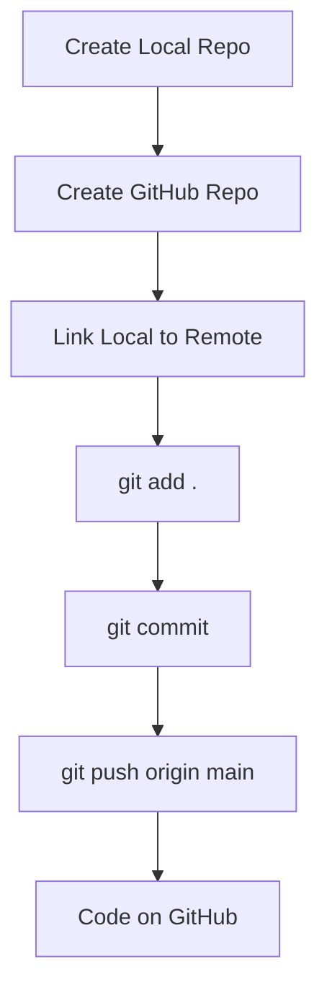

# Git Guide: Initializing a Local Repo and Pushing to Remote

## 1. Initializing a Local Git Repository

### What is Git?

Git is a version control system that tracks changes in your files and lets you collaborate with others. It helps you maintain different versions of your code and revert back to any previous state.

### Steps to Initialize a Local Repo

1. **Create a Directory**: This is where your project or files will reside.

   ```bash
   mkdir myfolder
   ```

   > `mkdir` command creates a new directory.

2. **Navigate into the Directory**: Move into the directory where you want to initialize Git.

   ```bash
   cd myfolder
   ```

3. **Check Git Status**: You can check if the folder is currently a Git repository.

   ```bash
   git status
   ```

   Output:  

   ```
   fatal: not a git repository (or any of the parent directories): .git
   ```

   - This means the directory is not yet a Git repository because it lacks the `.git` folder.
   - The `.git` folder is hidden and contains the entire repository’s metadata.

4. **Be Careful with Directory Location**: Ensure you are in the correct directory before initializing Git.  
   **Scenario**:  

   - If you run `git init` in a high-level directory (like `C:`), the entire folder structure from that point becomes a Git repository, which can be undesirable.

   - **Correct usage**:  
     Always `cd` into the directory where you want the Git repository to reside (in this case, `myfolder`).

5. **Initialize the Git Repository**:

   ```bash
   git init
   ```

   - This creates a hidden `.git` directory in your folder.

   - You can check the `.git` folder by running:

     ```bash
     ls -la
     ```

6. **Branch Names**:  
   After initializing, Git uses `main` as the default branch (it used to be `master` in earlier versions).

   - **`main`**: The primary branch where your code is maintained.

   > This is where your local repository is set up and ready to track changes.

### Diagram: Git Folder Initialization Flow


---

## 2. Pushing a Local Repo to GitHub

### What is a Remote Repository?

A remote repository is a Git repository that is hosted on a platform like GitHub, GitLab, or Bitbucket. This allows you to store and share your project code with others.

### Steps to Push a Local Repository to GitHub

1. **Create a Repository on GitHub**:

   - Go to [GitHub](https://github.com) and create a new repository. Don't initialize it with any files (`README`, `.gitignore`, etc.) if you already have local code.

2. **Link Your Local Repo to the Remote Repo**:

   ```bash
   git remote add origin https://github.com/username/repo-name.git
   ```

   - `origin`: A default name for the remote repository.
   - Replace `https://github.com/username/repo-name.git` with the actual URL of your GitHub repository.

3. **Add Files to Staging Area**:

   ```bash
   git add .
   ```

   This stages all files in the current directory for commit.

4. **Commit Your Changes**:

   ```bash
   git commit -m "Initial commit"
   ```

   - A commit captures a snapshot of the current state of your project.

5. **Push to GitHub**:

   ```bash
   git push -u origin main
   ```

   - This pushes your committed changes to the `main` branch on GitHub.

---

### Diagram: Push to Remote Repository



---

### Common Scenarios:

1. **Working Alone**:
   - You might use a local repository to track changes in your project on your computer. After making substantial progress, you push your code to GitHub to keep a backup or share it with others.

2. **Collaborating with a Team**:
   - A remote repository allows multiple developers to work on the same project and share their contributions by pushing and pulling code.

---

### Summary of Commands:

| Command                       | Description                                             |
| ----------------------------- | ------------------------------------------------------- |
| `mkdir <folder-name>`         | Creates a new folder                                    |
| `cd <folder-name>`            | Navigate into the folder                                |
| `git init`                    | Initializes a Git repository                            |
| `git add .`                   | Stages all files for commit                             |
| `git commit -m "message"`     | Commits staged files with a message                     |
| `git remote add origin <url>` | Links local repo to a remote repository                 |
| `git push origin main`        | Pushes code to the remote repository on the main branch |

---

### Additional Resources:

- [GitHub Guide](https://docs.github.com/en/get-started)
- [Git Book](https://git-scm.com/book/en/v2)
