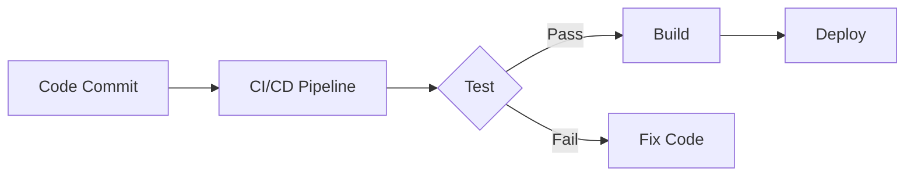
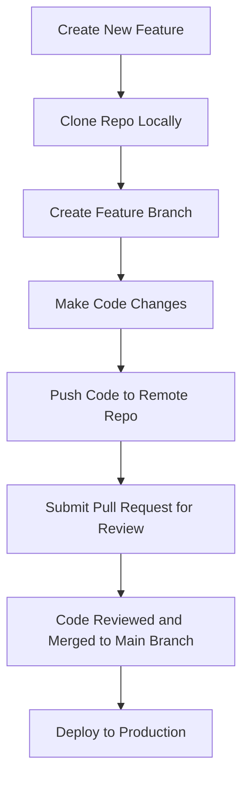

# Version Control, CI/CD, Repositories, and Setup Guide

## 1. **Version Control**

Version control is a system that records changes to a file or set of files over time so that you can recall specific versions later.

### **S3 Versioning**

- **Definition**: S3 versioning allows you to keep multiple versions of an object (file) in an Amazon S3 bucket. This helps in protecting data from accidental deletion or overwriting.
- **Use Case**: In case of accidental deletions, you can retrieve the latest or previous versions of objects.

### **Normal Version Control (Git)**

- **Definition**: Version control, specifically with Git, allows developers to track and manage changes in the source code over time. It provides a history of project development, which can be useful in case of errors, collaboration, or rollbacks.

### **Example**:

- Suppose you are working on a website. Each time you make a change to a file, Git tracks that change and stores a version. If the new code causes an error, you can revert to an earlier version using Git.

## 2. **Version Control Platforms: GitHub vs. GitLab**

| Feature            | GitHub                                                       | GitLab                                       |
| ------------------ | ------------------------------------------------------------ | -------------------------------------------- |
| **Purpose**        | Version control and collaboration platform                   | Version control with built-in CI/CD features |
| **CI/CD**          | Requires integration with GitHub Actions or third-party tools like Jenkins | Built-in CI/CD pipelines                     |
| **Authentication** | Uses OAuth, SSH keys                                         | Uses OAuth, SSH keys                         |
| **Popularity**     | Highly popular with open-source projects                     | More common in private enterprise use        |
| **Code Review**    | Extensive pull request (PR) functionality                    | Offers merge requests with more control      |

- Both **GitHub** and **GitLab** are remote version control platforms, commonly used by developers for collaboration.
- **Local platforms**: Examples include Bitbucket and SVN, which developers often use for their local repositories.

---

## 3. **CI/CD (Continuous Integration/Continuous Deployment)**

### **Definition**:

CI/CD stands for **Continuous Integration** and **Continuous Deployment**:

- **Continuous Integration (CI)**: Automatically test and integrate new code changes into the existing codebase, reducing integration issues.
- **Continuous Deployment (CD)**: Automatically deploys integrated code to production after passing all tests.

### **Using CI/CD in GitHub or GitLab**

- **GitHub**: CI/CD can be implemented using GitHub Actions.
- **GitLab**: CI/CD pipelines are built-in and offer extensive configuration via `.gitlab-ci.yml`.

#### **Steps for CI/CD Pipeline Setup**:

1. **Create Repository**: Set up your project on GitHub or GitLab.
2. **Configure a CI/CD file**:
   - **GitHub Actions**: Create a `.github/workflows/main.yml` file and define steps for testing and deployment.
   - **GitLab CI**: Add a `.gitlab-ci.yml` file with jobs for testing, building, and deployment.
3. **Run Jobs Automatically**: CI/CD automatically tests, builds, and deploys code after every push to the repository.



---

## 4. **Repository (Repo)**

### **Definition**:

A **repository** is a directory or folder where project files are stored. It contains all the files and folders of the project and a history of changes made to the code.

- Example: In Amazon, the **cart module** is managed by a specific team, while another team manages the **checkout module**. These teams collaborate by merging all modules into one main repository to launch the complete Amazon website.

### **Senior Developer Role**:

- A senior developer typically sets up the repository, gives instructions on what code needs to be written, and grants access to junior developers.

### **Junior Developer Role**:

- Junior developers clone the repository to their local machines, make changes, and push the changes back to their local repository.
- They typically don’t have write access to the central repository.

---

## 5. **Git Client: Git Bash**

- **Git Bash** is a command-line interface (CLI) that mimics Linux-like commands on Windows. It’s commonly used to interact with Git repositories using commands like `git clone`, `git pull`, and `git push`.

---

## 6. **Setting Up a Local Repository**

### **Steps to Work in a Repo**:

1. **Authentication**:
   - Set up authentication with GitHub or GitLab, so you don’t need to enter your username and password every time.

2. **SSH Authentication**:
   - For added security and convenience, set up **SSH authentication**. This ensures that your repository can be securely accessed without requiring credentials for every interaction.

### **Authentication Setup**:

1. Go to Google and search for "create SSH key for GitHub".
2. Follow the steps to generate an SSH key.
3. Add the generated SSH key to your GitHub account using the following email:
   - `midwayviber9@gmail.com`

---

## **Git Workflow**



### 3.  **Steps to Create an SSH Key for GitHub**

1. **Open Git Bash**:
   - If you don't have Git Bash installed, [download and install it from here](https://git-scm.com/).
  
2. **Generate SSH Key**:
   - In Git Bash, enter the following command:
     ```bash
     ssh-keygen -t rsa -b 4096 -C "midwayviber9@gmail.com"
     ```
   - This command generates a new SSH key using the RSA encryption algorithm, with a 4096-bit key for enhanced security.

3. **Save Key**:
   - When prompted to "Enter a file in which to save the key," simply press `Enter` to accept the default location (typically `/home/your_user/.ssh/id_rsa` on Linux or MacOS or `C:/Users/your_user/.ssh/id_rsa` on Windows).

4. **Set Passphrase** (Optional):
   - If you'd like extra security, you can enter a passphrase, or just press `Enter` twice to skip this step and proceed with the default settings.

5. **Key Generation Complete**:
   - Once complete, you should see a message confirming the generation of the SSH key, similar to the image below:
   
   

6. **Add SSH Key to GitHub**:
   - After generating the key, you will need to copy the public key and add it to your GitHub account.
   - Use this command to display your newly created public key:
     ```bash
     cat ~/.ssh/id_rsa.pub
     ```
   - On Windows, navigate to your `C:/Users/your_user/.ssh/` directory to find your SSH keys.
   - Copy the content of the `id_rsa.pub` file.
   - Go to [GitHub SSH Settings](https://github.com/settings/keys) to paste it under "New SSH key".


